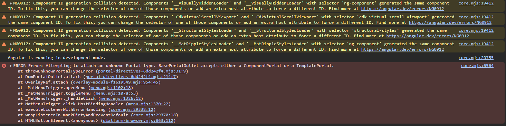

# Menu Bug with NX, Publishable Lib and @angular-architects/native-federtation

This app demonstrates an error with Angular Material which only shows up when you open a `mat-menu` with Angular Material Version 19.2.4 or newer.

## Setup 

Before serving the app run `npm i`

## Serve

Run `npx nx run nx-menu-bug:serve` to serve the test app which shows the bug.

## Reproduce error

Click the button to open the menu and you will see warnings and errors:

